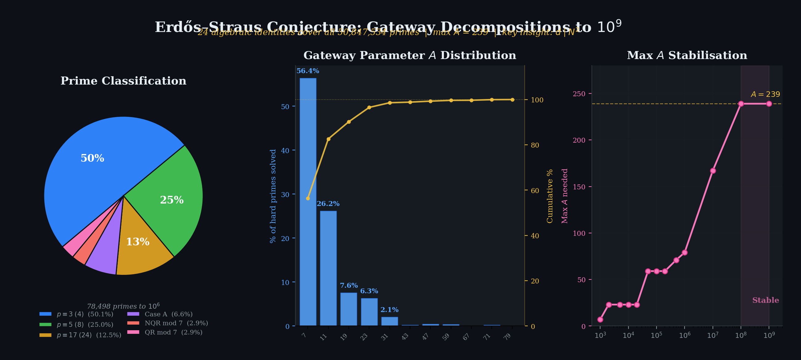

# Bounded Gateway Parameters for the Erdos-Straus Conjecture

[](erdos_straus_gateway.pdf)
[](#verification)
[](#bounded-a-phenomenon)
[](#bounded-a-phenomenon)
[](#figures)


**Gateway Decompositions via Divisors of N^2**



## Overview

The [Erdos-Straus conjecture](https://en.wikipedia.org/wiki/Erd%C5%91s%E2%80%93Straus_conjecture) (1948) asserts that for every integer n >= 2, the equation

    4/n = 1/x + 1/y + 1/z

has a solution in positive integers x, y, z.

This repository contains the paper, verification code, and figures for a unified algebraic approach to the prime case. Every prime `p = 3 (mod 4)` is handled classically with `A = 1`. For every prime `p = 1 (mod 4)`, a single auxiliary parameter `A` produces an explicit decomposition: three algebraic propositions cover all but a residual class, and a short search over prime values of `A` resolves the rest.

Verification to **10^11** (all 4,118,054,813 primes) succeeds with just **32 values of A** for the `p = 1 (mod 4)` primes - the value `A = 3` for the algebraic classes plus 31 distinct gateway values, all `= 3 (mod 4)` and all `<= 359`.

Separately, the paper proves **unconditionally** that the residual class is negligible - it has relative density zero among the primes, at the rate `O((log X)^{-1/2})` - so a single value `A = 3` suffices for a set of primes of density one. See [Density-One Theorems](#density-one-theorems).

## Key Results

### Explicit decomposition (computational)

**Theorem.** For every prime `p <= 10^11` with `p = 1 (mod 4)` in the residual class, there exists a prime `A <= 359` with `A = 3 (mod 4)`, `4 | (p + A)`, and a divisor `d` of `((p+A)/4)^2` satisfying `d = -p^2 * 4^{-1} (mod A)`, such that

    x = (p+A)/4,  y = (p*x + d)/A,  z = p*x*y/d

are positive integers giving `4/p = 1/x + 1/y + 1/z`.

The critical insight is that the integrality condition requires `d | N^2` (where `N = (p+A)/4`), which is **strictly weaker** than `d | N`. A nontrivial fraction of the hardest primes use a divisor `d > N` that is invisible under the stronger condition.

### Density-One Theorems

Write `A(p)` for the least prime `A = 3 (mod 4)` whose gateway succeeds at `p = 1 (mod 4)`. Since `3` is the least prime `= 3 (mod 4)`, `A(p) >= 3` always. Paper §5 proves, unconditionally:

**Theorem 5.4.** `#{p <= X : p = 1 (mod 4), A(p) > 3} << X (log X)^{-3/2}`.

So `A(p) = 3` for a set of primes of **density one**, and the residual class of §4 has relative density `O((log X)^{-1/2})` among the primes. The value `3` is optimal - there is no smaller gateway to shrink to.

**Theorem 5.6.** For each fixed `T`, with `k(T) = #{A <= T : A prime, A = 3 (mod 4)}`,

    #{p <= X : p = 1 (mod 4), A(p) > T}  <<_T  X (log X)^{-1-k(T)/2}

`T = 3` recovers Theorem 5.4; `T = 7` gives `O(X (log X)^{-2})`.

Both are elementary Selberg upper-bound sieves applied to the **integers** `n <= x`, with `p = 4n-3` and "`4n-3` has no prime factor `<= z`" used as a *majorant* for "`4n-3` is prime". That makes every remainder term elementary integer-counting, so **no equidistribution theorem is used anywhere** - no Bombieri-Vinogradov, no large sieve, no GRH. The sieve dimension is `1 + k/2`: one from the primality majorant, one half per gateway. Only upper bounds are proved; no matching lower bound is claimed.

These say nothing about `A(p)` being bounded for *every* prime (that is the open [bounded-A conjecture](#bounded-a-phenomenon)), and nothing about the Erdos-Straus conjecture itself, which is verified far beyond any height relevant here.

**Correction.** Earlier versions of the paper claimed the residual class had relative density zero on the strength of a Landau-type count of *integers* whose prime factors all lie in `1 (mod 3)` (`~ c x/sqrt(log x)`). That inference is invalid: dividing by `pi(X) ~ X/log X` gives `c sqrt(log X) -> infinity`, and the bound in fact exceeds `pi(X)` throughout the range of the paper. The conclusion was right; the argument was not. Theorem 5.4 is what establishes it. See paper Remark 5.7.

## Bounded-A Phenomenon

The maximum `A` grows extremely slowly with scale, over the range formally verified in this repository (every prime independently cross-checked by a separate implementation, per [Verification](#verification)):

| Limit | max A | Increase |
|-------|-------|----------|
| 10^6 | 79 | - |
| 10^7 | 167 | +88 |
| 10^8 | 239 | +72 |
| 10^9 | 239 | +0 |
| 10^10 | 359 | +120 |
| 10^11 | 359 | +0 |

The record-setting prime in this range is `p = 3,807,728,761` (`A = 359`, `d = 1935`), which lies below 10^10 - nothing in `(10^10, 10^11]` beats it. Across 4.1 billion primes, only **47** require `A >= 199` and only **5** require `A >= 251`.

**This flatness does not, by itself, support the bounded-A conjecture.** A distributional analysis of the tail of `A(p)` over this range (see the paper, §7.1, and [the companion analysis](extended-search/phase3a_growth_law.md)) shows two candidate growth models - one giving an absolutely bounded maximum, the other unbounded but extremely slow - that fit these six data points *identically*. A single decade of flatness cannot distinguish them.

Consistent with that, an **exploratory search past 10^11** (same validated engine as above; every witness with `A >= 100` - all 19,540 of them, not a sample - has since been independently re-derived, but the classification of the ordinary small-A primes has not, so still reported separately from the verified table) has since found two further records, at two separate jumps, before the search stopped at `1.212x10^12` with no further record:

| p | max A | Increase | |
|---|-------|----------|---|
| - | 359 | - | (carried from 10^11) |
| 235,229,251,009 | 367 | +8 | first new record |
| 418,383,886,321 | 479 | +112 | second new record |
| 1.212x10^12 (endpoint) | 479 | +0 | search stopped here |

Both record witnesses were independently re-derived from scratch by a separate reviewer, and - since - every witness with `A >= 100` in the range has been independently re-confirmed the same way: primality, that the divisor genuinely divides `N_A^2`, and an exhaustive check that every smaller gateway fails. Zero discrepancies across 19,540 witnesses ([full results](extended-search/tier1_verification.md)). The two jumps are different sizes (`+8`, then `+112`) - together `+120` over the interval, comparable to the single `239 -> 359` jump, but as two separate events rather than one. Either way, the occasional-large-jump pattern from the verified range continues past `10^11` rather than flattening further.

None of this refutes the **bounded-A conjecture** - `479` is a modest value, and the flat-vs-growing question remains genuinely open - but the flatness argument for it should be retired. The conjecture stands on its own as an open question, not as one the `10^10 -> 10^11` data supports. If true, the full Erdos-Straus conjecture follows.

**Closing the remaining gap - independently classifying every ordinary prime, not just the large-A witnesses - was costed and deliberately not done.** An independent implementation classifies primes at 13,000-19,000/second depending on scale ([calibration](extended-search/calibrate_tier2_verify.py)), so the 33,489,857,205 primes in `[10^11, 10^12]` alone would cost roughly 1-3 days of wall time even parallelised. The value of `max A` is already exhaustively settled by the witness check above, and a bug severe enough to silently misclassify billions of easy primes would very likely also have corrupted the gateway search already re-verified - so the additional confidence didn't justify several days of compute. Reported at this standard deliberately.

## Paper

The main paper (`erdos_straus_gateway.tex`) contains:

- **Section 3**: The Gateway Decomposition theorem and the `d | N^2` lemma
- **Section 4**: Algebraic existence proofs covering ~97.1% of all primes (at 10^6, rising with the bound)
- **Section 5**: The unconditional density-one theorems above, the identification of Case B with the failure of gateway 3 (Lemma 5.3), proof sketches, and the correction to the earlier density argument (Remark 5.7)
- **Section 6**: Computational verification for the remaining residual class (Case B QR7 primes), including an *Anatomy of the hardest prime* - a discrete-log proof of why `p = 3,807,728,761` forces `A = 359` (its N^2 divisors fill every unit mod 359)
- **Section 7**: Discussion of the bounded-A phenomenon and the path to a full proof

The residual class - `p = 1 (mod 24)`, a quadratic residue mod 7, with every prime factor of `(p+3)/4` congruent to `1 (mod 3)` - is related to but **not identical with** the classical Mordell subset `{1, 121, 169, 289, 361, 529} (mod 840)`; Remark 4.4 distinguishes them with explicit examples.

### Companion Document

- **`unconditional_bound.tex`** - An earlier, weaker unconditional density bound `E(X) = O(X/(log X)^{3/2})` on the count of primes not covered by any known algebraic or gateway decomposition, via the sharpness of gateway `A = 7`, a half-dimensional Selberg sieve, and a Bombieri-Vinogradov level of distribution. Also proves `A = 7` is the unique sharp gateway among the original 28-candidate list and discusses the character-sum barrier to an unconditional finiteness result. **Superseded on the density bound** by Theorem 5.6 above (`T = 7`), which bounds a larger set by `O(X (log X)^{-2})` and needs no Bombieri-Vinogradov input; the sharpness and barrier discussion stands.

## Verification

Run the self-contained verification script (Python 3.6+, standard library only):

```bash
python verify.py              # all primes to 10^6  (~10 seconds)
python verify.py 10000000     # to 10^7             (~2 minutes)
python verify.py 100000000    # to 10^8             (~30 minutes)
python verify.py 1000000000   # to 10^9             (~90 minutes, ~1 GB RAM)
```

Reproduce the hardest-prime analysis (Section 6.4):

```bash
python verify_hardest_prime.py   # checks every claim for p = 3,807,728,761
```

Example output at 10^6:

```
Erdos-Straus Gateway Verification to 1,000,000
============================================================
Category                                            Count        %
-------------------------------------------------------------------
  p = 2                                                 1    0.001%
  p = 3 (mod 4)  [Prop. 4.1]                      39,322   50.093%
  p = 5 (mod 8)  [Prop. 4.2a]                     19,623   24.998%
  p = 17 (mod 24) [Prop. 4.2b]                     9,820   12.510%
  Case A  [Prop. 4.2c]                             5,192    6.614%
  Case B NQR7  [Prop. 4.3]                         2,271    2.893%
  Case B QR7  [Thm. 5.1]                           2,269    2.891%
-------------------------------------------------------------------
  PROVEN                                          78,498  100.0000%
  OPEN                                                 0    0.00000%

Max A needed: 79
ALL 78,498 PRIMES TO 1,000,000 VERIFIED.
```

For the full-scale segmented, checkpointed verification to 10^10 / 10^11 (16-worker pool, GPU sieve if CuPy is present):

```bash
python sessions/session20_corrected_10B.py 10000000000  results/session20_checkpoint.json   # 10^10
python sessions/session20_corrected_10B.py 100000000000 results/session21_checkpoint.json   # 10^11
```

Each run validates against three independent baselines (the full A-distribution at 10^6, the residual count at 10^7, and the residual count and max A at 10^9) before extending the range, and verifies every solution by direct evaluation of the identity. The `results/` directory holds the resulting checkpoints with per-decade milestone snapshots.

## Figures

Generate the paper figures (requires matplotlib):

```bash
python collect_stats.py     # regenerate stats_1M.json (10^6 sample)
python generate_figures.py  # fig1-fig5 as PDF and PNG
python generate_banner.py   # the README banner
```

| Figure | Description |
|--------|-------------|
| fig1_coverage | Prime classification hierarchy (pie charts) |
| fig2_A_distribution | Gateway parameter A distribution (bar + cumulative) |
| fig3_max_A | Max A growth across scales (10^3 to 10^11 verified, to 1.3x10^12 exploratory) |
| fig4_d_over_N | d/N ratio distribution showing the N^2 extension |
| fig5_gateway_diagram | Conceptual schematic of the decomposition |

## The Open Problem

Since every prime outside the residual class is covered algebraically, the conjecture reduces to:

> For every prime `p = 1 (mod 24)` that is a quadratic residue mod 7 with all prime factors of `(p+3)/4` congruent to `1 (mod 3)`, does there exist a bounded prime `A = 3 (mod 4)` such that `((p+A)/4)^2` has a divisor in the residue class `-p^2 * 4^{-1} (mod A)`?

This is a question about **equidistribution of divisors in residue classes** for structured integers, connected to work of Hooley and Tenenbaum.

## Data Provenance

The verification pipeline was corrected in July 2026: an earlier run of the 10^10 stage inverted the Case A / Case B classification and searched the wrong set of primes. All figures in this repository derive from the corrected, baseline-validated pipeline (`sessions/session20_corrected_10B.py`) and are cross-checked against the checkpoints in `results/`. Section 6 of the paper documents the correction.

## Citation

```bibtex
@article{erdos-straus-gateway-2026,
  title={Bounded Gateway Parameters for the {Erd\H{o}s--Straus} Conjecture},
  author={\'O Murch\'u, Macdara},
  year={2026},
  note={Preprint}
}
```

## License

MIT
